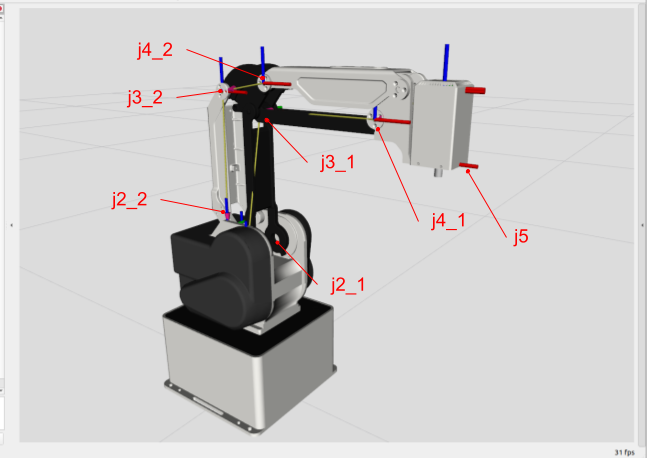

# Kinematics Tester for MG400

- `kinematics_tester_mg400.py` is for checking the kinematics of MG400.
- The joint angle `j2` and `j3` denote the link2 and link3 configurations with respect to the coordinate system fixed on the first link (link1).

## Relation between \{`j2`, `j3`\} and \{`j2_1`, $\cdots$, `j5`\}

- MG400 has 7 joints as follows:

- The motion of MG400 always holds the following relation:
  - `-25<j2<85`
  - `-25<j3<105`
  - `-60<j3_1<60`
  - where `j3_1=j3-j2`
